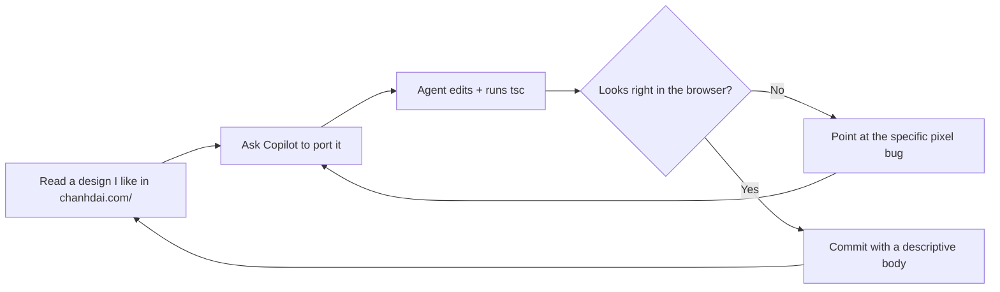

I rebuilt this portfolio over a couple of long weekends by pair-programming with GitHub Copilot chat in VS Code the entire time. It was not a "one-shot prompt spits out a website" experience — it was a lot of small, sharp iterations against a reference design, with the AI acting as a very fast (but very literal) collaborator. This post is the honest retrospective: what actually worked, what broke, and the specific tooling knobs that turned a novelty into an actual daily-driver workflow.

## The reference-clone pattern

The single most useful trick was not a prompt. It was a folder layout.

I cloned [chanhdai.com](https://chanhdai.com) into a sibling folder next to my own project, and opened both in the same VS Code workspace:

```txt
pf/
├── chanhdai.com/        ← reference (read-only, in my head)
├── portfolio/           ← my old portfolio (source of my data)
└── portfolio-updated/   ← the target — this site
```

That one decision changed the character of every conversation. Instead of describing what I wanted in prose — which is where LLMs love to hallucinate plausible-looking Tailwind — I could point at a real, working file: *"look at `chanhdai.com/src/components/site-footer.tsx` and port the two-strip pattern into `portfolio-updated/components/layout/footer.tsx`."* The agent would read both files, diff the important structural bits, and produce an edit that actually matched the reference.

The failure mode without the clone was consistent: the model would confidently invent a `screen-line-top` utility with subtly wrong offsets, or produce a `stripe-divider` that used `background-image: repeating-linear-gradient` when the real utility uses a `::before` pseudo-element at `z-index: -1`. With the clone in the tree, it just... read the CSS and matched it.

## Repo memory as a substitute for me repeating myself

Copilot exposes a scoped memory system — a set of Markdown notes it consults across turns. I ended up using three tiers heavily:

- **User memory** — cross-workspace preferences. Mine has exactly one rule that keeps saving me: *"never edit files inside `components/ui/`; those are shadcn-generated and re-running `pnpm dlx shadcn@latest add` will overwrite them. Bugs are always at the call site."*
- **Repo memory** — codebase conventions. This is where I recorded things like *"`screen-line-top` and `screen-line-bottom` render `::before/::after` at `left:[-100vw] w:[200vw]`, so parents MUST use `overflow-y-clip`, not `overflow-hidden` — the latter kills the horizontal bleed."* Every time the agent forgot and used `overflow-hidden`, I'd point at the memory file, and it stopped forgetting.
- **Session memory** — in-flight notes for a single conversation. Useful for keeping a running to-do list when I'm doing 15 small edits before a commit.

The mental model is not "the AI has a memory of me." It is "the AI reads a checklist before touching anything." Anything I have to correct twice, I write down. The next conversation starts already knowing.

## Skills — reusable domain knowledge, invoked by intent

Skills are Copilot's way of packaging *"when the user asks for X, follow these steps and use these tools."* Each is a Markdown file with a description and a set of instructions the agent loads on demand.

For this project the most-used one was the `agent-customization` skill itself — the meta-skill for authoring the customization files in the first place. But the shape of a skill is small enough to write your own without ceremony:

```md
---
name: my-shadcn-workflow
description: |
  Use when adding a shadcn primitive. Runs `pnpm dlx shadcn@latest add`,
  wires the component into the target file, and NEVER edits the generated
  file under components/ui/.
---
# My shadcn workflow

1. Confirm the component name exists in the shadcn registry.
2. Run `pnpm dlx shadcn@latest add <name>`.
3. Import from `@/components/ui/<name>` at the call site only.
4. If styling looks wrong, fix the CALL SITE, not the primitive.
```

The description is the routing key — Copilot reads all skill descriptions and picks the best match for the user's intent. The body of the skill is only loaded if the skill fires. This is different from stuffing everything into a giant system prompt: skills stay dormant until relevant, so your context window is not paying rent on knowledge you're not using.

## The iteration loop that actually worked

By the end I had converged on a very tight loop:



Two details make this loop fast enough to feel worth it:

1. **A shared browser page.** VS Code's browser tools let me pin a `localhost:3000` tab and share it with the agent. When I said *"the L-connector in the Experience section has a darker corner in dark mode,"* the agent could take a screenshot, confirm the bug, and reason about which CSS token was compounding alpha. Talking about pixels without pictures wastes turns.
2. **Commit-per-fix, with a real body.** Every accepted change gets a commit whose body explains *why*, not just *what*. This turned my git log into a running design-decision journal that I — and the next Copilot session — could scroll through later.

## Where the AI genuinely helped

- **Boring, mechanical refactors.** Renaming a token from `--border` (alpha) to `--border` (solid) and fixing the compounded `color-mix` derivations across the file. That kind of *"find every place this shape appears and make the analogous change"* work is where LLMs shine.
- **Explaining CSS I didn't write.** When I inherited the `screen-line` utility from the reference clone, I asked the agent to walk me through *why* it needs `overflow-y-clip` on the parent. That five-turn conversation replaced a good hour of me squinting at the cascade.
- **Keeping the design language coherent.** With the memory files in place, the agent stopped inventing new spacing scales and started reusing `min-h-16`, `border-line`, `text-muted-foreground` like the reference does. Consistency is a slog for humans and cheap for language models.

## Where it needed a firm hand

- **Aesthetic judgment.** The agent will happily produce three plausible footer layouts. It cannot tell you which one looks right on your machine. You have to look, and you have to be blunt: *"no, wrong, put the copyright INSIDE the striped strip, not below it."* The best sessions had me saying *"look at the screenshot"* about twice as often as I said *"write the code."*
- **Knowing when to stop.** Left to its own devices the agent will over-engineer. It wants to add error handling for cases that can't happen, docstrings on every function it touches, unit tests for one-liners. My repo memory now has a firm *"do not add error handling for scenarios that can't happen; only validate at system boundaries"* line, and it helps a lot.
- **Not silently editing generated code.** This is the one that cost me the most time before I codified it as a rule. shadcn primitives look editable, and the model wanted to reach into `components/ui/command.tsx` to fix a `CommandDialog` bug that was actually at the call site. Now there is one line in user memory that reads *"NEVER edit files inside `components/ui/`"* and it hasn't happened since.

## The single most useful line in my memory files

If you take exactly one thing from this post, take this: write down the mistakes you don't want to see again, in the same folder as your code. Whether you're using Copilot, Cursor, Claude Code, or any other agent — they all consult some flavor of persistent notes. The value is not in the AI remembering; it is in *you* remembering to write things down where the AI will re-read them next Tuesday when you've forgotten too.

For me that file is `.github/copilot-instructions.md` plus a handful of `AGENTS.md` files at the roots of each project. They are unglamorous. They are not clever. They are just the accumulated *"don't do that again"* list from every previous conversation, in the exact folder where the next conversation will start.

That is the whole trick.
