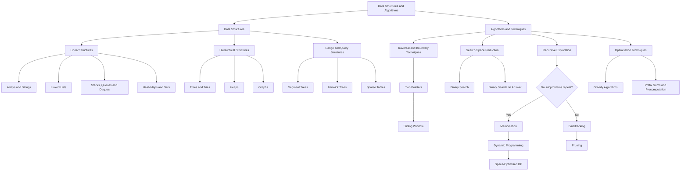
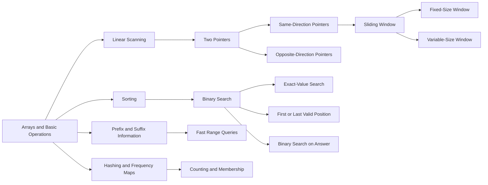
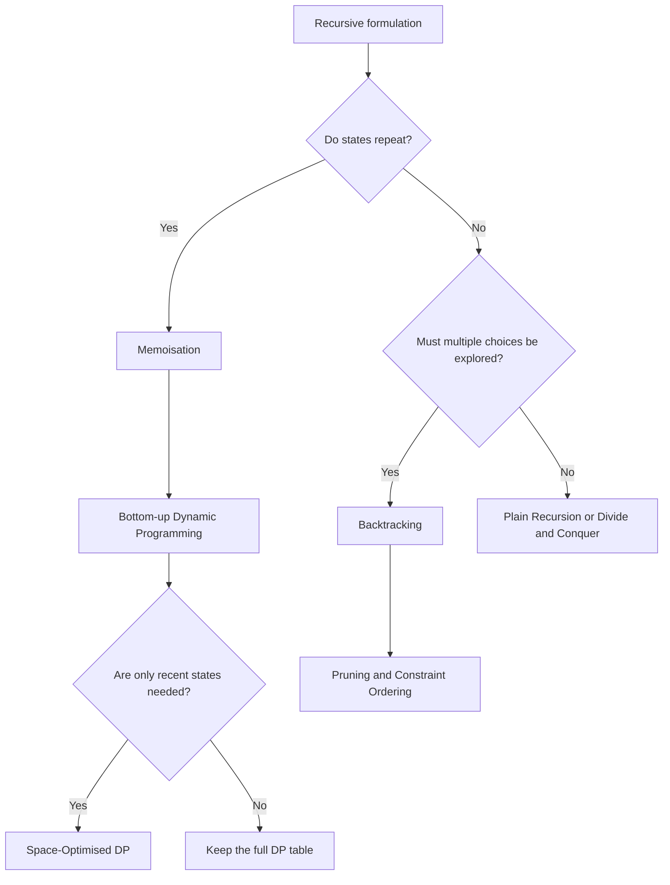

---
title: 'Stop Memorising DSA Sheets: Learn the Patterns Behind the Problems'
publishedAt: '2026-07-29'
summary: 'A practical guide for students preparing for their first software job and engineers preparing for a switch — why blindly completing DSA sheets is not enough, how common techniques connect, and how to build reusable problem-solving intuition instead of memorising solutions.'
image: 'https://images.unsplash.com/photo-1516321318423-f06f85e504b3?auto=format&fit=crop&w=1200&h=630&q=80'
category: 'Career'
tags: 'DSA, interviews, software engineering'
---------------------------------------------

There is no shortage of advice on preparing for software-engineering interviews.

Most students preparing for their first job and most working professionals preparing for a switch eventually land on the same set of resources: [NeetCode 150](https://neetcode.io/practice), Striver's SDE Sheet, or the A2Z DSA Sheet.

These are all good starting points. They organise a large and confusing subject into a sequence that feels manageable. You open the sheet, solve one problem, mark it complete, and move to the next.

The problem begins when completing the sheet becomes the goal.

A lot of people do not actually learn the technique behind a problem. They learn the solution to that specific problem. After seeing it two or three times, they can reproduce the same code almost from memory.

That creates the illusion of progress.

Then an interviewer changes the wording, combines two concepts, or adds one unfamiliar constraint—and suddenly the memorised solution is useless.

This is not another *"complete these 150 questions and crack every company"* roadmap. It is an attempt to explain how I think DSA should be learned: as a connected system of reusable ideas rather than a collection of unrelated questions.

## DSA sheets are a starting point, not a syllabus

Topic-wise sheets are useful because they reduce decision fatigue.

You do not have to spend thirty minutes every day deciding what to solve. The problems are already grouped into arrays, linked lists, binary search, trees, graphs, dynamic programming, and other categories.

But that organisation creates a misleading picture.

It makes DSA look like a set of independent folders:

```txt
DSA/
├── arrays/
├── binary-search/
├── sliding-window/
├── trees/
├── graphs/
└── dynamic-programming/
```

Real interview questions rarely respect those boundaries.

A single question may require you to:

1. Sort an array.
2. Use binary search to reduce the answer space.
3. Run a greedy or sliding-window check for every candidate answer.
4. Store intermediate values in a hash map.
5. Use a heap to keep track of the best candidates.

The problem is not purely a binary-search problem, a heap problem, or a sliding-window problem. Different parts of it require different tools.

This became much clearer to me while preparing for a job switch. Even though every sheet arranged questions topic by topic, the harder questions constantly moved between topics or used multiple concepts at the same time.

The useful question is therefore not:

> Which sheet topic does this problem belong to?

It is:

> What is the current bottleneck, and which technique removes it?

## Stop memorising problems; start recognising structures

When people say they have solved 300 or 500 DSA questions, that number does not tell you much.

Someone may have solved 500 questions by reading editorials, memorising implementations, and recognising previously seen problem names. Another person may have solved 120 questions but can derive the solution when the constraints change.

The second person is usually better prepared.

The purpose of solving problems is not to remember every answer. It is to develop a small set of reusable instincts:

* What information should I store?
* What part of the search space can I eliminate?
* Which state completely describes the remaining problem?
* Are subproblems repeating?
* Can I maintain an answer while moving through the input?
* Does sorting reveal an order that was previously hidden?
* Can one boundary move without reconsidering everything before it?

That is what people usually call pattern recognition. But pattern recognition should not mean memorising that *"Longest Substring Without Repeating Characters uses sliding window."*

It should mean understanding why a window works, what makes the window invalid, and why moving the left boundary restores validity.

## First, split DSA into data structures and algorithms

The name itself tells you how to organise the subject:

* **Data structures** define how information is stored and accessed.
* **Algorithms and techniques** define how that information is processed.

They interact constantly, but they are not the same thing.



This distinction matters because people often jump directly into advanced algorithms without understanding the structure on which the algorithm operates.

For example, a segment tree is not simply another random interview topic. It is a data structure designed to answer and update range-based information efficiently.

A heap is not merely something you memorise before solving *Top K Frequent Elements*. It is a structure that lets you repeatedly access the smallest or largest active element without fully sorting everything again.

The implementation matters, but the capability matters more.

## Start with arrays because almost everything grows from them

Arrays are usually taught first because they are easy to understand. But people often leave the topic too quickly.

They learn insertion, deletion, traversal, and perhaps a few basic problems before moving to the next chapter.

That misses the point.

Arrays teach the most important skill in DSA: controlling and interpreting positions.

You learn to:

* Move through elements.
* Maintain indices.
* Compare values at different positions.
* Track prefixes and suffixes.
* Rearrange elements.
* Divide the input into processed and unprocessed regions.
* Maintain information about a subarray.
* Reduce a search interval using boundaries.

From these basic operations, several major techniques emerge.



The exact hierarchy is not the important part. The important part is seeing that these techniques are connected.

Two pointers, sliding window, and binary search all involve maintaining boundaries. They are not identical algorithms, but they train the same broader habit: define a candidate region, evaluate it, and move a boundary without restarting the entire computation.

## Two pointers are a way of avoiding repeated work

The basic two-pointer idea is simple: use two positions to represent the part of the input currently being considered.

Sometimes the pointers begin at opposite ends:

```cpp
int left = 0;
int right = n - 1;

while (left < right) {
    if (condition()) {
        left++;
    } else {
        right--;
    }
}
```

Sometimes they move in the same direction:

```cpp
int left = 0;

for (int right = 0; right < n; right++) {
    // Process a[right].

    while (/* current range is invalid */) {
        // Remove or undo a[left].
        left++;
    }

    // The range [left, right] is valid here.
}
```

The real lesson is not the code.

The lesson is that one pointer represents new information entering the active region, while the other removes information that no longer belongs there.

Once you understand that, sliding window stops feeling like a separate trick.

## Sliding window is an extension of the same boundary idea

Sliding-window problems usually ask about a contiguous section of an array or string.

Instead of recomputing information for every possible subarray, we maintain the current window and update it when either boundary moves.

There are two broad categories.

### Fixed-size sliding window

The window length remains constant.

Examples include finding:

* The maximum sum of a subarray of length `k`.
* The average of every block of `k` elements.
* The number of distinct values in each window of size `k`.

A common template looks like this:

```cpp
int left = 0;

for (int right = 0; right < n; right++) {
    add(a[right]);

    if (right - left + 1 > k) {
        remove(a[left]);
        left++;
    }

    if (right - left + 1 == k) {
        processWindow();
    }
}
```

### Variable-size sliding window

The window expands and contracts according to a condition.

Examples include finding:

* The longest valid subarray.
* The shortest subarray satisfying a target.
* A substring with at most `k` distinct characters.
* A window whose sum remains within a constraint.

The usual structure is:

```cpp
int left = 0;

for (int right = 0; right < n; right++) {
    add(a[right]);

    while (!valid()) {
        remove(a[left]);
        left++;
    }

    updateAnswer(left, right);
}
```

Nearly every variable-size sliding-window problem contains the same questions:

1. What information enters when `right` moves?
2. What makes the current window invalid?
3. What information must be removed when `left` moves?
4. At what point is the window valid enough to update the answer?

Memorising the template may help you type faster. Answering these four questions is what actually solves the problem.

## Binary search is not sliding window—but it uses the same boundary mindset

It is tempting to describe binary search as another kind of shrinking window.

At a surface level, that is true: we maintain a range and repeatedly reduce it.

But binary search is conceptually different from sliding window.

Sliding window moves through a sequence while maintaining information about a contiguous region. Binary search eliminates part of an ordered search space based on a monotonic condition.

The standard implementation is:

```cpp
int left = low;
int right = high;

while (left <= right) {
    int mid = left + (right - left) / 2;

    if (isValid(mid)) {
        right = mid - 1;
    } else {
        left = mid + 1;
    }
}
```

The reusable pattern is:

1. Define the search space.
2. Pick a candidate.
3. Test a condition.
4. Decide which side can no longer contain the answer.
5. Remove that side permanently.

This becomes especially powerful in **binary search on answer**.

In those problems, you may not be searching an array at all. You may be searching for:

* The minimum possible capacity.
* The smallest maximum workload.
* The least time required.
* The largest feasible distance.
* The minimum speed needed to meet a deadline.

A typical binary-search-on-answer problem combines multiple techniques:

```txt
candidate answer
        ↓
binary search
        ↓
feasibility check
        ↓
greedy / counting / sliding window / graph traversal
```

This is exactly why learning problems only through topic labels is limiting. The outer algorithm may be binary search while the inner validation function uses a completely different idea.

## Look for the shared skeleton, not just the final code

Two pointers, sliding window, and binary search are not interchangeable. But they share a useful mental structure:

> Maintain a candidate region, evaluate a condition, and move a boundary so that unnecessary work is never repeated.

That is the part worth internalising.

When reading a solution, do not only ask why it uses two pointers or binary search. Ask:

* What does each boundary represent?
* What is guaranteed before the loop begins?
* What changes when a boundary moves?
* Why is the discarded region guaranteed to be useless?
* Which invariant remains true after every iteration?

An invariant is simply something that stays true throughout the algorithm.

For a sliding window, the invariant may be:

> After the shrinking loop finishes, the current window satisfies the required constraint.

For binary search, it may be:

> The answer, if it exists, remains inside the current search interval.

For a two-pointer partition, it may be:

> Everything before the left pointer has already been processed correctly.

Once you begin identifying invariants, templates stop being magic code snippets. They become implementations of a logical guarantee.

## Recursion should lead to a decision tree, not directly to DP

Dynamic programming is another topic that people frequently memorise.

They learn standard solutions for Fibonacci numbers, climbing stairs, knapsack, longest common subsequence, and coin change. But when the state changes slightly, they struggle to construct the recurrence.

A better starting point is plain recursion.

Recursion asks:

> If I make one decision now, what smaller version of the same problem remains?

After writing the recursive formulation, inspect the resulting states.



If the same state is solved repeatedly, memoisation can store its answer.

From there, the progression is usually:

```txt
recursion
    ↓
memoisation
    ↓
bottom-up dynamic programming
    ↓
space optimisation
```

But space-optimised DP is not the final badge of honour for every problem. Optimising the memory too early often makes the code harder to understand and easier to break.

First derive the state and transition correctly. Optimise only after you can explain which previous states are actually required.

## Backtracking is not simply recursion without memoisation

When recursive states do not repeat, but the problem requires exploring multiple choices, the result is often backtracking.

Typical examples include:

* Generating permutations.
* Producing combinations.
* Solving constraint-placement problems.
* Searching paths through a maze.
* Partitioning a set into valid groups.

A generic structure looks like this:

```cpp
void solve(State& state) {
    if (isComplete(state)) {
        recordAnswer(state);
        return;
    }

    for (const Choice& choice : availableChoices(state)) {
        if (!isValid(choice, state)) {
            continue;
        }

        apply(choice, state);
        solve(state);
        undo(choice, state);
    }
}
```

The important operations are not merely recursion and return. They are:

```txt
choose
explore
undo
```

Memoisation can sometimes be added to backtracking, but only when different paths reach the same reusable state.

Adding a cache blindly does not automatically improve a recursive solution. If the state contains the entire unique path taken so far, there may be nothing useful to reuse.

Again, the question is not:

> Can I add memoisation here?

It is:

> Will the same meaningful state be computed again?

## Boilerplates are useful only after you understand their invariants

There is nothing wrong with maintaining templates.

In fact, during interviews, having reliable boilerplates for binary search, graph traversal, union-find, segment trees, or sliding window can save time and prevent implementation mistakes.

The mistake is learning the template before learning what each part guarantees.

For every boilerplate you keep, you should be able to explain:

* The meaning of every variable.
* The loop condition.
* The update rule.
* The invariant.
* The termination condition.
* Common off-by-one failures.
* Which problem constraints make the approach valid.
* Which changes would make the template invalid.

For binary search, for example, you should know why these two forms are different:

```cpp
while (left <= right)
```

and:

```cpp
while (left < right)
```

You should know whether `right` is inclusive or exclusive. You should know whether the loop is looking for an exact value, the first valid position, or the last valid position.

Copying a template without understanding those choices is how people produce code that looks almost correct and fails on one boundary case.

## A better way to use NeetCode and Striver sheets

Do not throw away the sheets. Use them differently.

Instead of measuring progress only by completed questions, maintain a pattern notebook.

For each problem, write down:

```txt
Problem:
Initial brute force:
Bottleneck:
Useful observation:
Technique:
State or invariant:
Why the approach works:
What variation would break it:
Related problems:
```

For example:

```txt
Problem:
Longest substring without repeating characters

Initial brute force:
Generate every substring and check whether all characters are unique.

Bottleneck:
Repeatedly checking characters already seen in overlapping substrings.

Useful observation:
When a duplicate appears, only the left boundary must move.

Technique:
Variable-size sliding window with a frequency map.

Invariant:
After shrinking, every character in the current window is unique.

Variation that may break it:
If the problem asks for a non-contiguous subsequence, a window is no longer valid.
```

This takes longer than simply marking a checkbox. That is the point.

The checkbox records activity. The explanation records learning.

## Learn families of problems together

Once you solve a problem, do not immediately jump to an unrelated topic.

Solve two or three variations that force the same idea to change.

For sliding window, a useful progression is:

```txt
fixed-size maximum sum
        ↓
longest window satisfying a condition
        ↓
shortest window satisfying a condition
        ↓
window with frequency constraints
        ↓
window with exactly K properties
```

For binary search:

```txt
exact search
        ↓
first and last occurrence
        ↓
lower bound and upper bound
        ↓
rotated sorted array
        ↓
binary search on answer
        ↓
binary search with a complex feasibility check
```

For dynamic programming:

```txt
plain recursion
        ↓
memoised recursion
        ↓
bottom-up table
        ↓
state reduction
        ↓
space optimisation
```

This is how you learn the stable idea underneath changing problem statements.

## The real goal is decomposition

The most important skill in DSA is not recognising the entire solution instantly.

It is decomposing a large problem into smaller questions:

* Can I preprocess something?
* Is the input ordered, or can I sort it?
* Is the answer monotonic?
* Is the problem about a contiguous range?
* Do I need fast membership checks?
* Are states repeating?
* Is this a shortest-path problem?
* Do I repeatedly need the smallest or largest element?
* Are there multiple independent choices?
* What is the brute-force bottleneck?

A difficult problem often becomes manageable once each part is assigned the correct tool.

For example:

```txt
Need the minimum feasible value
        ↓
Is feasibility monotonic?
        ↓
Yes: binary search the answer
        ↓
How do I test one candidate?
        ↓
Greedy scan with two pointers
```

The final solution uses binary search and two pointers. But neither topic label alone describes the reasoning process.

## The most useful change I made during interview preparation

The biggest improvement in my preparation did not come from switching from one sheet to another.

It came from stopping after every problem and asking:

> What idea from this solution can survive after I forget the problem?

The problem statement will disappear from memory. The exact variable names will disappear. The code may disappear too.

What should remain is something like:

* A monotonic condition can turn an optimisation problem into binary search.
* A moving boundary can remove repeated range computation.
* A prefix value can convert a range query into subtraction.
* Repeated states suggest memoisation.
* A heap is useful when only the next best candidate matters.
* Sorting can expose an order that makes greedy decisions possible.
* Backtracking becomes practical only when invalid branches are cut early.

Those observations transfer.

Memorised answers do not.

DSA sheets are useful maps. They are not the territory, and finishing one is not proof that you understand the subject.

Use the sheets to choose problems. Use patterns, invariants, and decomposition to actually learn from them.

That is the difference between recognising a question and being able to solve a new one.
